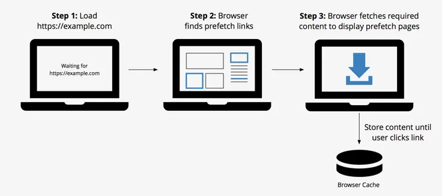

###  一、资源提示与指令来提升页面性能的方法
https://juejin.im/post/5b5984b851882561da216311#heading-8

preload 
prefetch 
preconnect

有哪些区别呢？

如何充分利用他们？

好处：允许前端开发人员来优化资源的加载， 减少往返路径并且在浏览页面时候可以更快的加载到资源


### 二、具体方法

#### 1、Preload
- 基本理解
    - 一种新的控制特定资源如何被加载的新的web标准
    - 如何使用呢？ <link rel="preload"> 
    - 可以使用其加载最重要的资源，比如图像、css、Js和字体；
    - 注意：不要与浏览器预加载混淆，浏览器预加载只预先加载在HTML中声明的资源
    - preload指令解决了以上限制，允许预加载在CSS和Javascript中定义的资源，并允许决定何时应用每个资源
    - preload与prefetch的不同在于它专注于当前的页面，并以高优先级加载资源
    - Prefetch 专注于下一个页面将要加载的资源并以低优先级加载
    - preload 并不会阻塞 window 的 onload 事件。
    - link rel="preload" href="./es.js" as="script"> style/image/font/document

- 好处
    - 允许浏览器来 设定资源加载的优先级,因此可以允许前端开发者来优化指定资源的加载。
    - 赋予浏览器决定资源类型的能力，因此它能分辨这个资源在以后是否可以重复利用
    - 浏览器可以通过指定 as 属性来决定这个请求是否符合 content security policy。
    - 浏览器可以基于资源的类型（比如 image/webp）来发送适当的 accept 头

```html
    //预加载图像的例子
    <link rel="preload" href="image.png">

    //预加载字体的例子  记住：如果你的预加载需要 CORS 的跨域请求，那么也要加上 crossorigin 的属性。
    <link rel="preload" href="https://example.com/fonts/font.woff" as="font" crossorigin>

```

通过 HTML 和 JavaScript 预加载样式表的例子：
```html
<link rel="preload" href="/css/mystyles.css" as="style">
```
```javascript

var res = document.createElement("link"); 
res.rel = "preload"; 
res.as = "style"; 
res.href = "css/mystyles.css"; 
document.head.appendChild(res); 
```


#### 2、prefetch

- prefecth是一个低优先级的资源提示，允许浏览器在后台（空闲时）获取将来可能用得到的资源，并且将他们存储在浏览器的缓存中。一旦一个页面加载完毕就会开始下载其他的资源，然后当用户点击了一个带有 prefetched 的连接，它将可以立刻从缓存中加载内容。
- 有三种不同的 prefetch 的类型，link，DNS 和 prerendering
- 具体过程:
  - load
  - Browser finds prefetch links
  - 


- Link Prefetching
  - link prefetching 假设用户将请求它们,所以允许浏览器获取资源并将他们存储在缓存中。
  - 浏览器会寻找 HTML <link> 元素中的 prefetch 或者 HTTP 头中如下的 Link
  ```html
    HTML: <link rel="prefetch" href="/uploads/images/pic.png">
    <!- HTTP Header: Link: </uploads/images/pic.png>; rel=prefetch ->
  ```
  - 这项技术有为很多有交互网站提速的潜力，但并不会应用在所有地方。对于某些站点来说，太难猜测用户下一步的动向，对于另一些站点，提前获取资源可能导致数据过期失效。还有很重要的一点，不要过早进行 prefetch，否则会降低你当前浏览的页面的加载速度

- DNS Prefetching
    - DNS prefetching 允许浏览器在用户浏览页面时在后台运行 DNS 的解析
    - DNS 的解析在用户点击一个链接时已经完成，所以可以减少延迟
    - 可以在一个 link 标签的属性中添加 rel="dns-prefetch' 来对指定的 URL 进行 DNS prefetching
    - 我们建议对 Google fonts，Google Analytics 和 CDN 进行处理。
    - DNS 请求在带宽方面流量非常小，可是延迟会很高，尤其是在移动设备上,通过 prefetching 指定的 DNS 可以在特定的场景显著的减小延迟，比如用户点击链接的时候。有些时候，甚至可以减小一秒钟的延迟 
    - 这也对需要重定向的资源很有用
    ```html
    <!-- Prefetch DNS for external assets -->
    <link rel="dns-prefetch" href="//fonts.googleapis.com">
    <link rel="dns-prefetch" href="//www.google-analytics.com"> 
    <link rel="dns-prefetch" href="//opensource.keycdn.com">
    <link rel="dns-prefetch" href="//cdn.domain.com">

    ```

- Prerendering
    - Prerendering 和 prefetching 非常相似, 它们都优化了可能导航到的下一页上的资源的加载
    - 它们都优化了可能导航到的下一页上的资源的加载, 整个页面所有的资源
    ```html
    <link rel="prerender" href="https://www.keycdn.com">
    ```
    - prerender 提示可以用来指示将要导航到的下一个 HTML, 用户代理将作为一个 HTML 的响应来获取和处理资源，要使用适当的 content-types 获取其他内容类型，或者不需要 HTML 预处理，可以使用 prefetch
    - 要小心的使用 prerender，因为它将会加载很多资源并且可能造成带宽的浪费，尤其是在移动设备上。    

- Preconnect
  - preconnect 允许浏览器在一个 HTTP 请求正式发给服务器前预先执行一些操作，包括 DNS 解析，TLS 协商，TCP 握手，这消除了往返延迟并为用户节省了时间。
  - Preconnect 是优化的重要手段，它可以减少很多请求中的往返路径 —— 在某些情况下可以减少数百或者数千毫秒的延迟。
  

  - preconnect 可以直接添加到 HTML 中 link 标签的属性中，也可以写在 HTTP 头中或者通过 JavaScript 生成，如下是一个为 CDN 使用 preconnect 的例子：
  ```html
    <link href="https://cdn.domain.com" rel="preconnect" crossorigin>

  ```
  