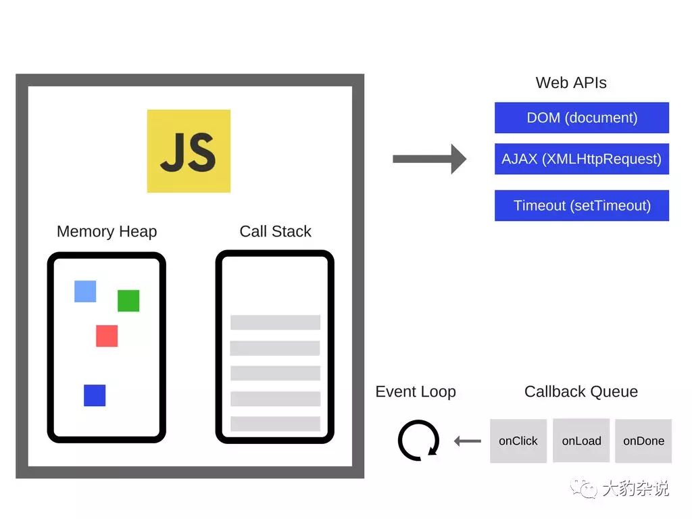

>全面解析Vue.nextTick实现原理

### 一、vue中有一个较为特殊的API，nextTick。

- 官方文档的解释，它可以在DOM更新完毕之后执行一个回调，用法如下：
在下次 DOM 更新循环结束之后执行延迟回调。在修改数据之后立即使用这个方法，获取更新后的 DOM。
```javascript
    // 修改数据
    vm.msg = 'Hello';
    // DOM 还没有更新
    Vue.nextTick(function () {
        // DOM 更新了
    })
```

- 尽管MVVM框架并不推荐访问DOM，但有时候确实会有这样的需求，尤其是和第三方插件进行配合的时候，免不了要进行DOM操作, 而nextTick就提供了一个桥梁，确保我们操作的是更新后的DOM。

- 本文从这样一个问题开始探索：vue如何检测到DOM更新完毕呢？
>检索一下自己的前端知识库，能监听到DOM改动的API好像只有MutationObserver了，后面简称MO.


- 理解MutationObserver
  - MutationObserver是HTML5新增的属性，用于监听DOM修改事件，能够监听到节点的属性、文本内容、子节点等的改动，是一个功能强大的利器，基本用法如下：
  ```javascript
    //MO基本用法
    var observer = new MutationObserver(function(){
        //这里是回调函数
        console.log('DOM被修改了！');
    });
    var article = document.querySelector('article');
    observer.observer(article);
  ```

  - MO的使用不是本篇重点。这里我们要思考的是：vue是不是用MO来监听DOM更新完毕的呢？

  ```javascript
  //vue@2.2.5 /src/core/util/env.js
  if (typeof MutationObserver !== 'undefined' && (isNative(MutationObserver) ||                      MutationObserver.toString() === '[object MutationObserverConstructor]')) {

      var counter = 1

      var observer = new MutationObserver(nextTickHandler)

      var textNode = document.createTextNode(String(counter))

      observer.observe(textNode, {

          characterData: true

      })

      timerFunc = () => {

        counter = (counter + 1) % 2

        textNode.data = String(counter)

      }

  }
  ```

  - 简单解释一下，如果检测到浏览器支持MO，则创建一个文本节点，监听这个文本节点的改动事件，以此来触发nextTickHandler（也就是DOM更新完毕回调）的执行。后面的代码中，会执行手工修改文本节点属性，这样就能进入到回调函数了。

  - 大体扫了一眼，似乎可以得到实锤了：哦！vue是用MutationObserver监听DOM更新完毕的！

  - 难道不感觉哪里不对劲吗？让我们细细想一下：
     - 我们要监听的是模板中的DOM更新完毕，vue为什么自己创建了一个文本节点来监听，这有点说不通啊！
     - 难道自己创建的文本节点更新完毕，就能代表其他DOM节点更新完毕吗？这又是什么道理！

  - 看来我们上面得出的结论并不对，这时候就需要讲讲js的事件循环机制了。


- 事件循环（Event Loop）
  - 在js的运行环境中，我们这里光说浏览器吧，通常伴随着很多事件的发生，比如用户点击、页面渲染、脚本执行、网络请求，等等。为了协调这些事件的处理，浏览器使用事件循环机制。
  - 简要来说，事件循环会维护一个或多个任务队列（task queues），以上提到的事件作为任务源往队列中加入任务。有一个持续执行的线程来处理这些任务，每执行完一个就从队列中移除它，这就是一次事件循环了，如下图所示：
  

  - 我们平时用setTimeout来执行异步代码，其实就是在任务队列的末尾加入了一个task，待前面的任务都执行完后再执行它。

  - 关键的地方来了，每次event loop的最后，会有一个UI render步骤，也就是更新DOM。。标准为什么这样设计呢？考虑下面的代码：


>参考文档

  1、[全面解析Vue.nextTick实现原理](https://juejin.im/entry/5aced80b518825482e39441e)